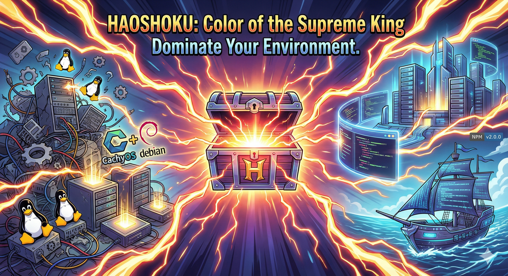

# Haoshoku: Color of the Supreme King

**Haoshoku** (formerly Bankai) is a modular, multi-distro Linux setup and configuration toolkit. It automates the installation of essential applications, developer tools, terminal configs, and user environment tweaks.

> [!NOTE]
> **Haoshoku** (referencing ["Supreme King Haki"](https://onepiece.fandom.com/wiki/Haki/Supreme_King_Haki) from *One Piece*) serves as an authoritative configuration manager, enforcing a strict and consistent environment setup across your Linux systems.

> [!IMPORTANT]
> **Rebranding & Migration**: This project was previously known as **Bankai** and was available on **PyPI** (Python). It has been renamed to **Haoshoku** and is now available on **NPM** (JavaScript/Bun). Please uninstall old Python versions (`pipx uninstall bankai`) before installing.

## Quick Start

### Option 1: Run with Bun (Recommended)
```bash
# Clone the repo
git clone https://github.com/axatbhardwaj/bankai.git
cd bankai

# Install dependencies
bun install

# Run the setup
bun haoshoku.js
```

### Option 2: Install via npm (Alternative)
```bash
npm install -g haoshoku
haoshoku
```

## CLI Usage

Haoshoku provides command-line options for non-interactive use or specific tasks.

```bash
# Run for a specific OS (skips detection/prompt)
haoshoku --os cachyos
haoshoku --os debian-server

# Sync Claude Code configuration only (without OS setup)
haoshoku --claude

# Install OpenAgents Control (Advanced Profile)
haoshoku --opencode
```

## Features

### Supported Platforms
-   **CachyOS / Arch Linux**: Full desktop environment setup (KDE Plasma), gaming optimizations, and daily driver tools.
-   **Debian Server**: Minimal, secure server setup with Docker, UFW, and Fail2ban.

### What It Does
-   **Terminal & Shell**:
    -   Installs and configures **Fish Shell** as default.
    -   Sets up **Starship** prompt and **Fisher** plugins.
    -   Deploys custom configs for **Ghostty**, **Kitty**, **Alacritty**, and **Fastfetch**.
-   **Developer Ecosystem**:
    -   **Languages**: Rust (Rustup), Python (Uv/Conda), Node.js (Volta/NVM).
    -   **Tools**: Docker, Git (with signing), Neovim/VS Code, Foundry (Smart Contracts).
-   **System Hardening (Debian)**:
    -   Configures **UFW** firewall (allow SSH/HTTP/HTTPS).
    -   Sets up **Fail2ban** for SSH protection.
    -   Enables auto-updates and essential system utilities.
-   **Desktop Experience (Arch)**:
    -   Installs curated Flatpaks (Obsidian, Discord, Spotify).
    -   Optimizes KDE Plasma settings.
    -   Sets up gaming tools (Steam, Lutris) and media players (mpv).
-   **AI Configuration**:
    -   **Claude Code Sync**: Automatically syncs your Claude Code settings, including custom agents, tips, and permissions (`haoshoku --claude`).
    -   **OpenAgents Control**: Installs the full OpenAgents Control framework (Advanced profile) for AI agent workflows (`haoshoku --opencode`).

## Configuration

All configuration templates are stored in the `configs/` directory and are symlinked or copied during setup:

-   `configs/fish/`: Fish shell configuration and functions.
-   `configs/ghostty/`: Ghostty terminal config.
-   `configs/kitty/`: Kitty terminal config.
-   `configs/starship.toml`: Cross-shell prompt theme.
-   `configs/fastfetch/`: System information fetch tool config.
-   `deskback/`: Assets and wallpapers.

## Development

### Testing

Run the test suite using Bun's native test runner:

```bash
bun test
```

### Linting & Formatting

This project uses [Biome](https://biomejs.dev/) for fast linting and formatting.

```bash
# Format code
bun run format

# Lint code
bun run lint
```

## For Developers

To modify or extend the scripts:

1.  Clone the repository.
2.  Install dependencies: `bun install`
3.  Run locally: `bun haoshoku.js`

**Project Structure:**
-   `src/os_scripts/`: OS-specific logic (`cachyos.js`, `debian_server.js`).
-   `configs/`: Configuration files to be deployed.
-   `common/`: Package lists and shared utilities.

## License
MIT